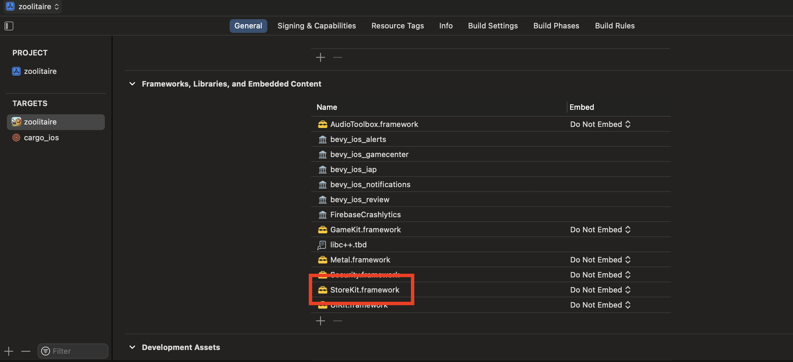
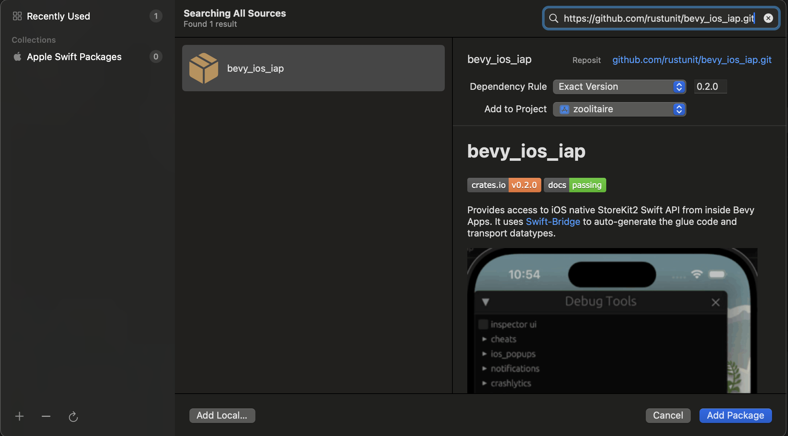

# bevy_ios_iap

[![crates.io][sh_crates]][lk_crates]
[![docs.rs][sh_docs]][lk_docs]
[![discord][sh_discord]][lk_discord]

[sh_crates]: https://img.shields.io/crates/v/bevy_ios_iap.svg
[lk_crates]: https://crates.io/crates/bevy_ios_iap
[sh_docs]: https://img.shields.io/docsrs/bevy_ios_iap
[lk_docs]: https://docs.rs/bevy_ios_iap/latest/bevy_ios_iap/
[sh_discord]: https://img.shields.io/discord/1176858176897953872?label=discord&color=5561E6
[lk_discord]: https://discord.gg/rQNeEnMhus

Provides access to iOS native StoreKit2 Swift API from inside Bevy Apps.
It uses [Swift-Bridge](https://github.com/chinedufn/swift-bridge) to auto-generate the glue code and transport datatypes.


> Demo from our game using this crate: [zoolitaire.com](https://zoolitaire.com)

## Features
* fetch products
* purchase products
* listen to changes in transaction states
* fetch list of all transactions (to restore old purchases of non-consumables)
* supports subscriptions
* convenient observer based API

## Notes
* does not return locally un-signed/un-verified transactions

## Todo
* allow access to signature for remote verification
* support offers
* support family sharing

## Instructions

1. Add to XCode: Add SPM (Swift Package Manager) dependency
2. Add Rust dependency
3. Setup Plugin

### 1. Add to XCode

* Add `StoreKit` framework:


* Go to `File` -> `Add Package Dependencies` and paste `https://github.com/rustunit/bevy_ios_iap.git` into the search bar on the top right:


* Don't forget to configure your purchases like for any other iOS app, this guide will not focus on that, as it is the same no matter what engine you use. this guide focuses on setting things up in a bevy project.

**Note:** 
The rust crate used must be **exactly** the same version as the Swift Package (for binary compatibility reasons).
I suggest using a specific version (like `0.2.0` in the screenshot) to make sure to always use binary matching versions!

### 2. Add Rust dependency

```
cargo add bevy_ios_iap
``` 

or 

```toml
# always pin to the same exact version you also of the Swift package
bevy_ios_iap = { version = "=0.2.1" }
```

### 3. Setup Plugin

Initialize Bevy Plugin:

```rust
// request initialisation right on startup
app.add_plugins(IosIapPlugin::new(true));
```

```rust
fn bevy_system(mut iap: BevyIosIap) {
    // If you set the plugin to manual init, this will register the 
    // TranscactionObserver to listen to updates to any Transactions and trigger
    // `IosIapEvents::Transaction` accordingly.
    // Note: this will require the user to be logged in into their apple-id and popup a login dialog if not
    bevy_ios_iap::init();

    // request product details, product IDs have to be explicitly provided
    iap.products(vec!["com.rustunit.zoolitaire.levelunlock".into())])
        .on_response(|trigger: Trigger<Products>| match &trigger.event().0 {
            IosIapProductsResponse::Done(products) => {
                info!("products loaded: {}", products.len());

                for p in products {
                    info!("product: {:?}", p);
                }
            }
            IosIapProductsResponse::Error(e) => error!("error fetching products: {e}"),
        });

    // trigger a product purchase for a specific product ID
    iap.purchase("com.rustunit.zoolitaire.levelunlock".into())
        .on_response(|trigger: Trigger<Purchase>|{
            match &trigger.event().0 {
                IosIapPurchaseResponse::Success(t) => {
                    info!("just purchased: '{}' {}", t.product_id, t.id);

                    iap.finish_transaction(t.id).on_response(on_finish_transaction);
                }
                _ => {}
            }
        });

    // request to restore active subscriptions and non-consumables
    iap.current_entitlements()
        .on_response(|trigger: Trigger<CurrentEntitlements>|{
            info!("current entitlements: {}", trigger.event());
        });
}
```

Process Response Events from iOS back to us in Rust:

```rust
fn process_iap_events(
    mut events: EventReader<IosIapEvents>,
) {
    for e in events.read() {
        match e {
            // this is triggered when a transaction verification state changes during the runtime of the app
            IosIapEvents::TransactionUpdate(_) => todo!(),
        }
    }
}
```

## Our Other Crates

- [bevy_debug_log](https://github.com/rustunit/bevy_debug_log)
- [bevy_device_lang](https://github.com/rustunit/bevy_device_lang)
- [bevy_web_popups](https://github.com/rustunit/bevy_web_popups)
- [bevy_libgdx_atlas](https://github.com/rustunit/bevy_libgdx_atlas)
- [bevy_ios_review](https://github.com/rustunit/bevy_ios_review)
- [bevy_ios_gamecenter](https://github.com/rustunit/bevy_ios_gamecenter)
- [bevy_ios_alerts](https://github.com/rustunit/bevy_ios_alerts)
- [bevy_ios_notifications](https://github.com/rustunit/bevy_ios_notifications)
- [bevy_ios_impact](https://github.com/rustunit/bevy_ios_impact)

## Bevy version support

|bevy|bevy\_ios\_iap|
|---|---|
|0.15|0.5,main|
|0.14|0.3,0.4|
|0.13|0.2|

# License

All code in this repository is dual-licensed under either:

- MIT License (LICENSE-MIT or http://opensource.org/licenses/MIT)
- Apache License, Version 2.0 (LICENSE-APACHE or http://www.apache.org/licenses/LICENSE-2.0)

at your option. This means you can select the license you prefer.

## Your contributions
Unless you explicitly state otherwise, any contribution intentionally submitted for inclusion in the work by you, as defined in the Apache-2.0 license, shall be dual licensed as above, without any additional terms or conditions.
